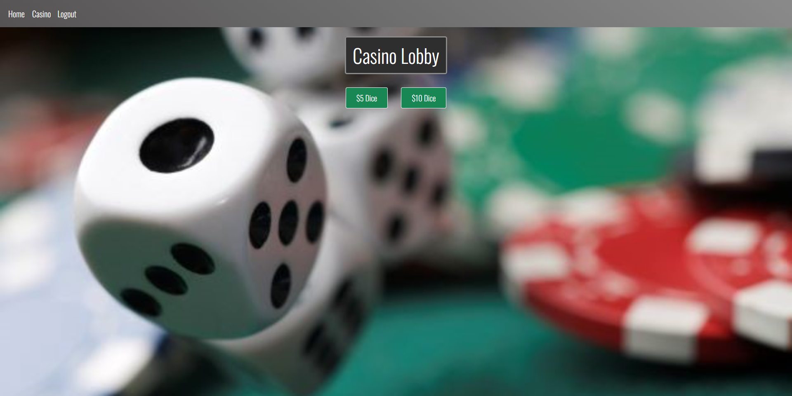

# Cloud 247 Casino

 

## Description and Link:

An online casino (no real money, just for fun). Still a lot we plan to add, but worth a visit. Please try it out here:  
<a href='https://cloud247casino.herokuapp.com/'>Link to deployed version</a>

 

## Table of contents:

  * [Installation](#installation)
  * [Tests](#tests)
  * [Authors](#authors)
  * [Questions](#questions)

 

## Installation:
 
      To run locally, clone the repo, and run npm install in the same folder. 
      Add a .env file containing: 
      DB_NAME=casino_db 
      DB_PW=...your mysql password... 
      DB_USER=root 
      MAIL_PW=...your email password (for an email service that allows apps to log in)... 
      MAIL_ADDY=...your email address... 

 
  

  
  
## Tests: 
 
No tests have been implemented at this time.
 
 

## Authors:

 

[jasonjayoo](https://github.com/jasonjayoo)  [BroBrett](https://github.com/BroBrett)  [nialvo](https://github.com/nialvo)
  
 
 

## Questions:

  If you have any questions, feel free to contact me at: 
  <a href="mailto:nialvo@protonmail.com">Email</a>

