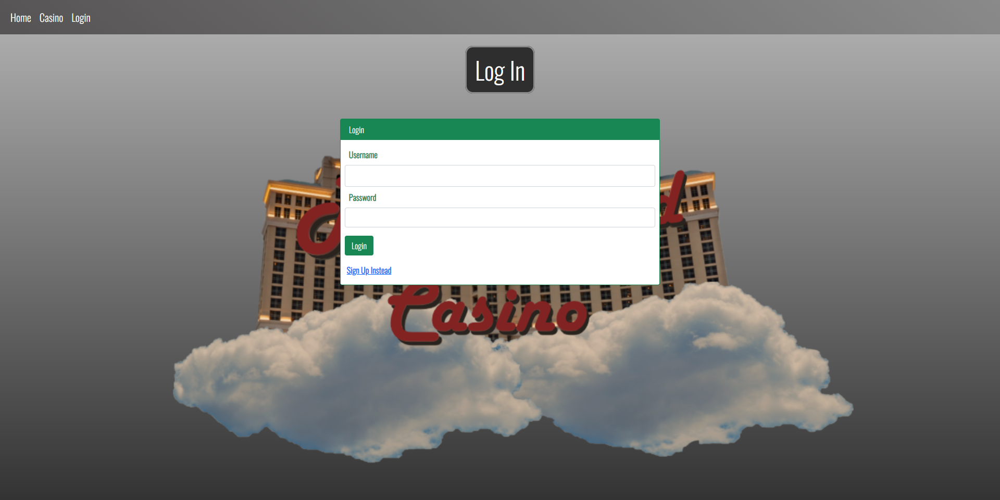
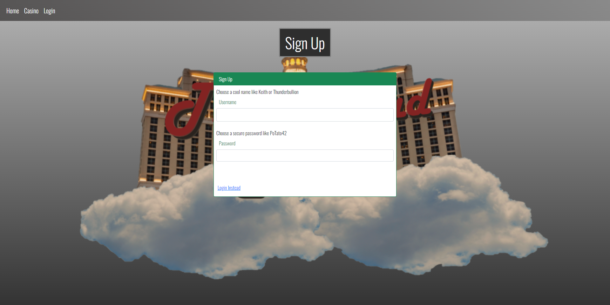
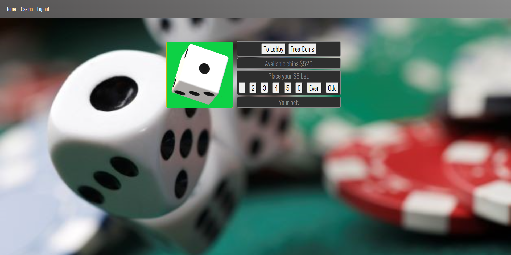
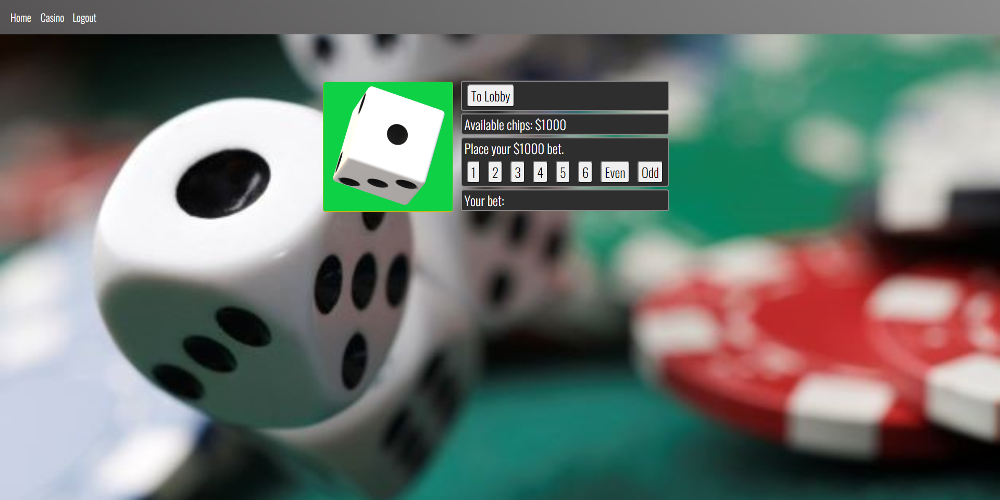
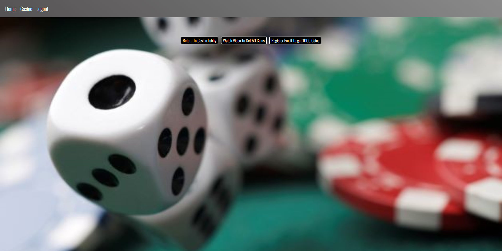
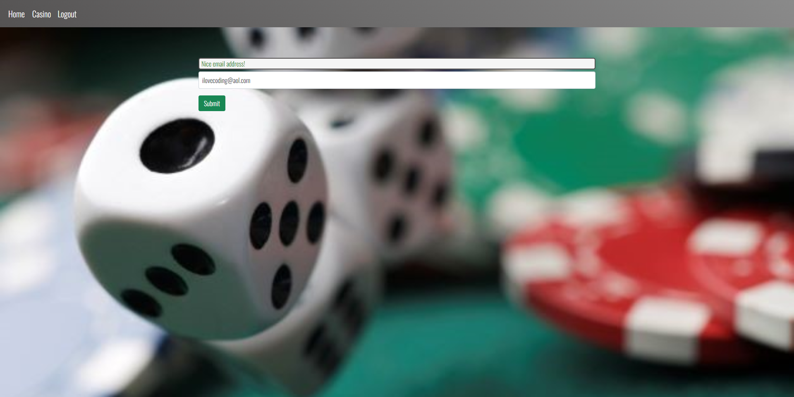

# The Cloud Casino

(Project-2; Interactive Full-Stack Application)

 

## Description:

We are an online casino where users are required to create an account to login in to our site and play Dice!. Users will be allowed to either login or create a new & unique username and password in order to enter the casino lobby. After entering, users are given the options of five different dice rooms: [5, 10, 100, 500 and 1000 coins]. Our VIP gaming room is designated for users who have emassed at least 1000 coins. Users can view an advertisement video in order to gain 50 coins. If users register an email with us, they can gain 1000 coins when they click on the link we provided in to their email address. Furthermore, users can log out of the site and still retain the coins they've amassed. Whenever a user re-logs in to our site, the coins they've amassed will re-render to their account. 

 

## User Story:

I like gambling but I dont want to risk my hard earned money. So, I want a program that can recreate the experience of gambling without actually risking my funds. I want a game where I can obtain virtual money from winning and lose it when I lose my bet. Therefore, I get the experience of possibly losing or winning money just like how a real gambling experience is, without actually losing real money. If I run out of my virtual coins, I have the options of watching a short video or registering my email in order to obtain more virtual funds. If I win enough money I will unlock accessibility to higher betting tiers that will allow me to access higher limit rooms.

 

## Acceptance Criteria:

- Users must create a original username and password in order to login to our web application.
 

- Entering a unique username and password creates an account that is linked to their IP address along with the username and password they've created. 
 
-  A verified email address can be entered by the user in order to obtain more virtual funds
 

- Users starts the game with 500 chips(1 chip = 1 dollar - "NOT REAL MONEY")
 

- Users can bet a minimum 5 chips in the five hundred room, 10 in the one hundred dollar room or five hundred in the five hundred dollar room
 

- If the user runs out of coins they have the option to watch a short video or register their email in order to gain sdditional coins
 

- User can win from the starting room (5, 10, 100, 500 bet), the VIP room is the (1000 bet).
 

- If the user is finished playing they can save their current chips count and log out (their total funds will be store in the database for future plays)

 

## Table of contents:

 
  * [Heroku](#heroku)
  * [Installation](#installation)
  * [Usage](#usage)
  * [Contributions](#contributions)
  * [Tests](#tests)
  * [Authors](#authors)
  * [Questions](#questions)

 
  

## Heroku:

https://glacial-reef-71102.herokuapp.com/
  
 

## Installation:
 
      To run locally, clone the repo, and run npm install in the same folder. 
      Add a .env file containing: 
      DB_NAME=casino_db 
      DB_PW=...your mysql password... 
      DB_USER=root 
      MAIL_PW=...your email password (for an email service that allows apps to log in)... 
      MAIL_ADDY=...your email address... 

 
  
## Usage: screenshots - (Highlighted Title(s) = a hyperlink to the direct image)

 

Once downloaded, open the file in VS Code.

 
  

[Screenshot1](images/homepage-screenshot.png)  "Initial page when loaded: Main logo with navbar. Login required to enter casino." 

 

[Screenshot2](images/login-screenshot.png)  "Login Page: User can enter username and password to enter casino"

 

[Screenshot3](images/sign-up-screenshot.png)  "Creating an account: User can create a username and password as long as they meet the standard requirements."

 

[Screenshot4](images/casino-lobby-screenshot.png)  "Casino Lobby: User will be directed to pick either 5, 10, 100, or 500 dice."

 

[Screenshot5](images/$5-dice-screenshot.png)  "5, 10, 100, and 500 coin Game of Dice: User can pick numbered bets from 1-6 and even or odd. User will be able to see wether their bet was correct or false and their available chips. Users will need to play these levels in order to gain access to 1000 coin betting room.

 

[Screenshot6](images/1000-dice-screenshot.png)  "1000 coin Game of Dice: User can pick numbered bets from 1-6 and even or odd. Users have to bet 1000 coins per bet. User will be able to see wether their bet was correct or false and their available chips."

 

[Screenshot7](images/free-coins-screenshot.png)  "Free Coins: User will be able to watch a short video to gain 50 coins. The User will be able to gain 1000 coins if they register their email."

 

[Screenshot8](images/email-registration-screenshot.png)  "Email Registration: User can register email to obtain 1000 free coins."

 
 

  
## Contributions:
 
Reach us at our github accounts provided below

 
 
  
## Tests: 
 
No tests have been implemented at this time.
 
 

## Authors:

 

[jasonjayoo](https://github.com/jasonjayoo)  [BroBrett](https://github.com/BroBrett)  [nialvo](https://github.com/nialvo)
  
 
 

## Questions:

  For any questions regarding this application, you may reach me directly at jasonjayoo@outlook.com.

  To view our other applications, please check out our github pages [jasonjayoo](https://github.com/jasonjayoo), [BroBrett](https://github.com/BroBrett), [nialvo](https://github.com/nialvo).

